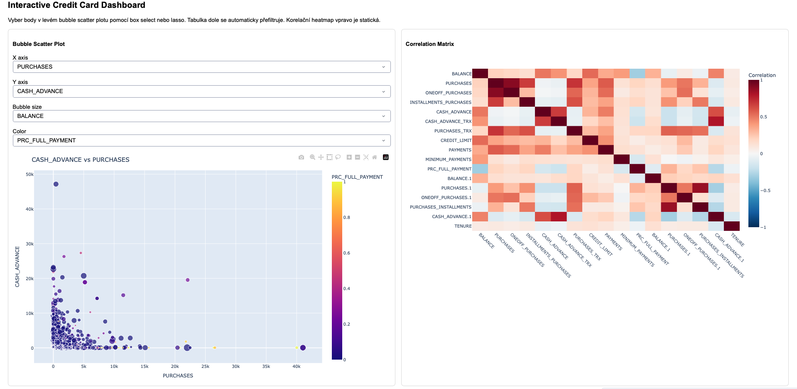

# Credit Card Customer Behavior Analysis

This project explores credit card customer behavior using exploratory data analysis (EDA) and an interactive visualization dashboard built with Python.

The goal is to analyze relationships between purchases, cash advances, credit limits, and customer payment behavior.

---

# Project Structure
credit-card-eda
│
├── data
│   ├── credit_cards.csv
│   └── credit_cards_clean.csv
│
├── notebooks
│   ├── 01_preprocessing.ipynb
│   └── 02_eda_visualization.ipynb
│
├── dashboard
│   └── app.py
│
└── README.md

# Features

- Data preprocessing and cleaning
- Exploratory Data Analysis (EDA)
- Correlation analysis
- Interactive dashboard with Plotly Dash
- Scatter bubble visualization
- Correlation heatmap
- Interactive dataset filtering

---

# Dataset

The dataset contains credit card usage information for approximately **4700 customers**, including:

- balance
- purchases
- cash advances
- credit limits
- payment behavior
- tenure

---

# Technologies

- Python
- Pandas
- Plotly
- Dash
- Jupyter Notebook

---

# Running the Dashboard

Install required libraries
pip install pandas numpy plotly dash

Run the dashboard server:
python dashboard/app.py

The dashboard will be available at:
http://127.0.0.1:8050/

---

# Example Visualizations

The dashboard includes:

- Bubble scatter plot for exploring relationships between variables
- Correlation heatmap for identifying dependencies between features
- Interactive filtering with a scrollable data table

---

# Author

Ondřej Kratina
